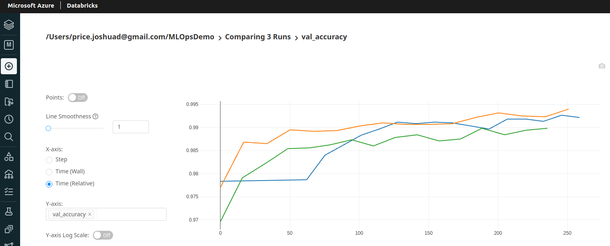
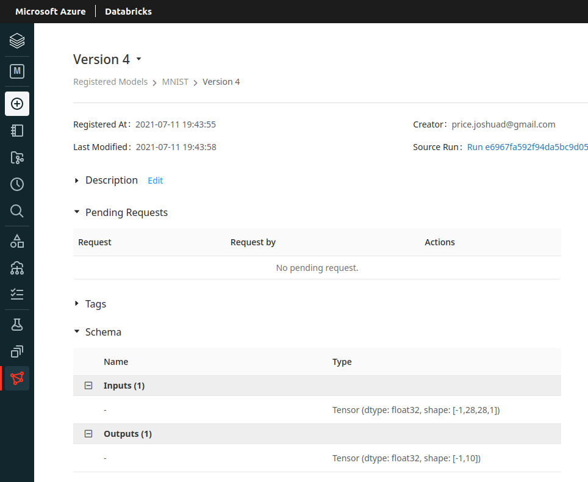

# Josh Price MLOps Demo Project

## Overview
I have created this project to demonstrate some general MLOps skills for potential employers.  

What I'll be describing here can be summarized as a Tensorflow model running from a Databricks notebook on an Azure cluster.  I'm using Databricks-hosted MLFlow to track and serve my model, which is a simple MNIST classification.

## Infrastructure
To create the hosting environment, I used [Terraform](https://www.terraform.io/) which helps automate the initial setup.  

Azure was chosen mainly for its excellent Databricks integration.

## The Code
As the focus of this particular project was the Ops side, I kept the ML side fairly simple.  Included in this repository is the Python scipt used to build my model from the existing Keras MNIST dataset.

## MLFlow
All experiment runs are fully logged in MLFlow, making for easy comparisons of the metrics and source code used for every model.

## API & Deployment
When we've got a model that meets our criteria (in this case, a simple check to confirm that the final accuracy is at least 99%) we can register it to allow it to be deployed as a REST API using MLFlow's internal tools.

In a real production environment, I'd use something like Seldon Core (configured in my initial Terraform setup file) to deploy the API to a Kubernetes cluster.  Due to how quickly the cost of a Kubernetes cluster can build up, I have instead simply included an example Terraform configuration that I might use if I were to deploy for production.

A (very simple) Dockerfile has been included for demo purposes.

## Possible Improvements
If developing something like this with a team, I'd use a local development environment and push my code to Github (as opposed to the online Notebook currently in use).  Databricks could then be configured to watch my repo for commits and optionally run and deploy the API automatically.  
